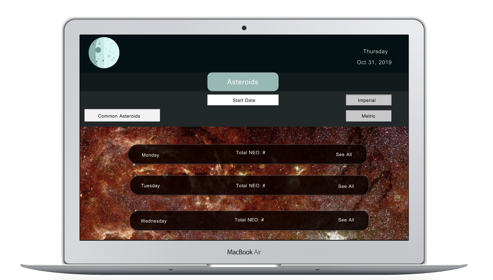
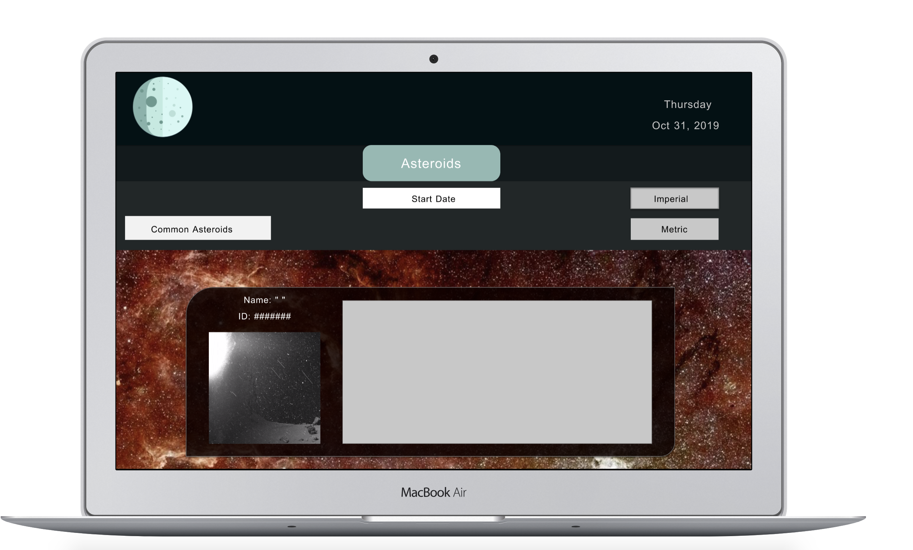
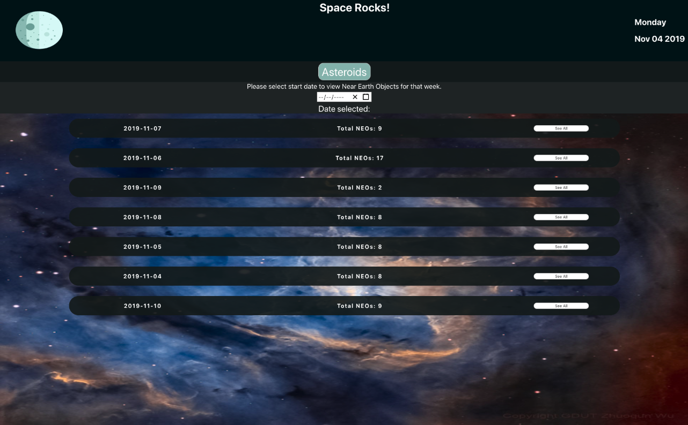
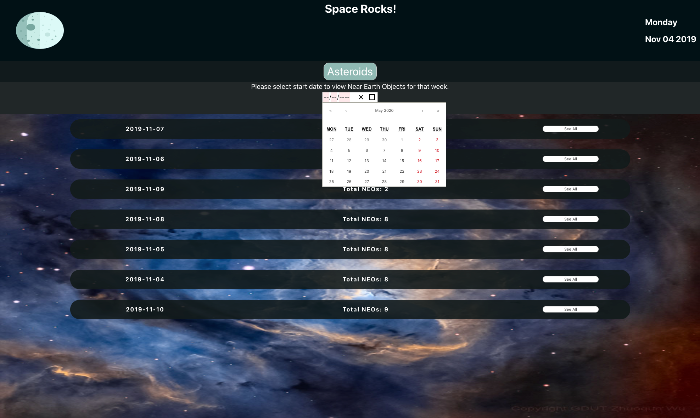

# Space Rocks

Space Rocks is a React-Redux App that uses the [NASA Astronomy Picture of the Day API & the Asteroids Near Earth Object Web Service API](https://api.nasa.gov/) to allow a user to search by week and see the Near Earth Objects (astroids and comets) for that week.

### Focuses

- Consume an API and build a functional and well tested application in 5 days.

- Make informed design decisions to create a user-friendly application.

- Become comfortable with making network requests with an API key.

- Solidify concepts with React to create clean and re-useable components.

- Become comfortable with Redux’s lifecycle, creating actions, reducers, and connecting them to React components.

- Understand and solidify concepts with React component, asynchronous code, and Redux testing.

### ScreenShots
  WireFrames made in InVision Studio
  - Weekly view of asteroids found from query:
    

  - View of an individual information card to an asteroid:

    


  DOM Display:
  - Space Rocks asteroid page loads with the current week. Nasa's Astronomy picture of the day is the background image and it updates daily:


  - Space Rocks asteroid page allows you to search the NASA API by week:


  - Space Rocks asteroid page allows you click on a date and see and NEOs for that day:


  - Space Rocks even has error handling if the API does not respond:


### Tech
- This project was bootstrapped with Create React App utilizing Redux.

- Tested with Jest/Enzyme.

### Team
- This was a solo project, inspired by [NASA APIs](https://api.nasa.gov/)
- [Lacy Rudd](https://github.com/dawnlunacy)
### Set Up

Clone repo.
```
git clone https://github.com/dawnlunacy/nasa-api
```
Install dependencies.
```
npm install
```
Run browser.
```
npm start
```
